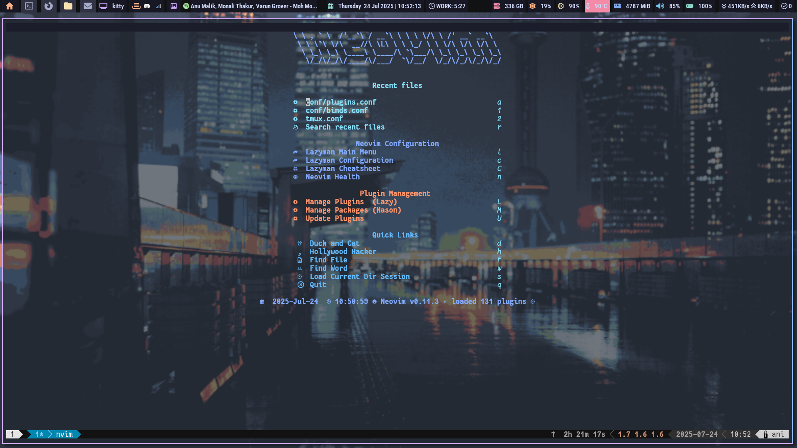

<p align="center">
  
  
  
  
</p>

<p align="center">POLYBAR</p>

<p align="center">
  <b>WARNING: Linux configs break. Often. This Polybar setup is no exception. Be prepared to tinker.</b>
</p>

---

## Gallery


<p align="center">
  
</p>
<p align="center">
  
</p>
<p align="center">
  
</p>


<p align="center">

</p>

## Why I Built This 


So, I got tired of bland, boring status bars. I wanted something that not only looked slick but also gave me all the info I needed, right when I needed it. That's why I dove deep into Polybar. This repo? It's my experiments. I've poured a lot of thought (and a few late nights) into making this both beautiful and functional. I hope you dig it!

##Structure

I like things organized, so I've structured this repo like my digital workspace – clean and logical. Here's the lowdown on where everything lives:

-   `config.ini`: This is the brain of my Polybar. It's where I define the bar's overall look, feel, and which modules get to shine.
-   `launch.sh`: My trusty script to kickstart Polybar. I use this to make sure everything fires up correctly when I log in or just want to restart the bar.
-   `modules/`: This is my modular playground. I've broken down my Polybar components (like colors, specific module configs) into separate `.ini` files here. It keeps my `config.ini` tidy and makes it super easy for me to swap things around or update individual bits.
-   `scripts/`: This is where all my custom scripts live. These are the little workhorses that fetch dynamic data for my modules – think network speeds, system updates, and other cool stuff.
-   `screenshots/`: This is where I'll drop some eye candy – screenshots and maybe even a demo video of my Polybar in action. You gotta see it to believe it!


## Dependencies 

To get the full experience of this Polybar setup, you'll need a few things installed on your system. Here's a list of the main dependencies:

-   **Polybar**: The star of the show!
    -   *Arch Linux*: `sudo pacman -S polybar`
    -   *Debian/Ubuntu*: `sudo apt install polybar`
-   **Nerd Fonts**: For those awesome icons. Install your favorite Nerd Font (e.g., FiraCode Nerd Font, JetBrainsMono Nerd Font) and run `fc-cache -fv`.
-   **`feh`**: For setting wallpapers, especially if you're using the `get_wallpaper.sh` script.
    -   *Arch Linux*: `sudo pacman -S feh`
    -   *Debian/Ubuntu*: `sudo apt install feh`
-   **`pywal`**: If you want dynamic colors based on your wallpaper.
    -   *Installation*: `pip install pywal` (ensure you have `python-pip` installed first)
-   **`libnotify-bin`**: For desktop notifications (e.g., pomodoro timer).
    -   *Arch Linux*: `sudo pacman -S libnotify` (or a notification daemon like `dunst`)
    -   *Debian/Ubuntu*: `sudo apt install libnotify-bin`
-   **`pulseaudio-utils`** (or `alsa-utils`): For sound playback (e.g., pomodoro timer sound).
    -   *Arch Linux*: `sudo pacman -S pulseaudio-alsa` (or `alsa-utils`)
    -   *Debian/Ubuntu*: `sudo apt install pulseaudio-utils` (or `alsa-utils`)
-   **`iproute2`**: Provides the `ip` command used in network scripts (usually pre-installed).
-   **`pacman-contrib`**: For the `checkupdates` script on Arch Linux.
    -   *Arch Linux*: `sudo pacman -S pacman-contrib`

## Getting Started - Your Journey Begins Here

## Getting Started 


Ready to try out my setup? Awesome! You have two main options:

### Option 1: Use the Automated Install Script (Recommended for Fresh Setups)

For a quick and easy setup, especially on a fresh system, use the provided `install.sh` script. This script will:

-   Detect your operating system (Arch Linux or Debian/Ubuntu).
-   Install Polybar and all necessary dependencies (you may be prompted for your `sudo` password).
-   Clone this repository into `~/.config/polybar` (backing up any existing configuration).
-   Make all custom scripts executable.

To run the automated installer:

```bash
cd /path/to/ani-bar # Navigate to the cloned repository directory
sudo ./install.sh
```

After the script completes, it will provide instructions on how to launch Polybar and set it up for autostart.

### Option 2: Manual Installation (For the Tinkerer)

If you prefer to do things manually, here's how:

1.  **Install Dependencies**: Make sure you have all the necessary dependencies installed as listed in the "Dependencies" section above.
2.  **Clone My Repo**: Grab a copy of my config. I usually put it in my `~/.config/polybar` directory, but you do you.
    ```bash
    git clone @github.com:aniismess/ani-bar.git ~/.config/polybar
    ```
3.  **Script Power-Up**: My custom scripts need to be executable. I just `chmod +x` everything in the `scripts/` directory.
    ```bash
    chmod +x ~/.config/polybar/scripts/*
    ```
4.  **Launch It!**: Fire up Polybar using my `launch.sh` script. You can add this to your window manager's autostart file (like `~/.config/i3/config` for i3, or `~/.xinitrc` for others).
    ```bash
    ~/.config/polybar/launch.sh
    ```

## Theming & Customization 

I've designed my Polybar setup to be pretty flexible, so you can tweak it to your heart's content. Here's how I usually go about it:

### Colors

If you want to change the color scheme, I recommend starting with `modules/colors.ini`. That's where I define all my main colors. Just change the hex codes there, and your bar will get a whole new vibe. If you're using `pywal` like me, `modules/wal_colors.ini` will handle the dynamic colors based on your wallpaper, so you might not need to touch `colors.ini` much.

### Fonts

My fonts are defined in `config.ini` under the `[bar/i3_bar]` section. I've picked a few that I like, but you can swap them out for your favorites. Just make sure you have the fonts installed on your system, especially any Nerd Fonts for those sweet icons. If icons are missing, try `fc-cache -fv` after installing new fonts!

### Modules

All my individual module configurations live in `modules/modules.ini`. If you want to:

-   **Add a new module**: Just create a new `[module/your_module_name]` section in `modules/modules.ini` and then add `your_module_name` to the `modules-left`, `modules-center`, or `modules-right` lines in `config.ini`.
-   **Remove a module**: Simply take it out of the `modules-left`, `modules-center`, or `modules-right` lines in `config.ini`.
-   **Rearrange modules**: Just reorder them in the `modules-left`, `modules-center`, or `modules-right` lines in `config.ini`. It's that easy!

I've tried to keep each module's configuration self-contained in `modules/modules.ini` so it's easy to understand and modify.

## Troubleshooting & Distro Woes 

Even the best setups hit a snag sometimes. Here are some common issues I've run into and how I usually fix them, especially across different Linux distros:

### Icons are Missing or Look Like Boxes!

This is usually a font issue. My config uses [Nerd Fonts](https://www.nerdfonts.com/) for those cool icons. Make sure you have them installed and your font cache is updated.

-   **Fix**: Install a Nerd Font (e.g., `FiraCode Nerd Font`, `JetBrainsMono Nerd Font`). Then, run `fc-cache -fv` to rebuild your font cache. Restart Polybar.
-   
### My Scripts Aren't Working

Polybar relies on external scripts for a lot of dynamic info. If something's not showing up, it's probably a script problem.

-   **Fix**: First, check if the script is executable: `ls -l ~/.config/polybar/scripts/your_script.sh`. If it doesn't have `x` permissions, run `chmod +x ~/.config/polybar/scripts/your_script.sh`. Also, check the script's output directly in your terminal to see if it's throwing errors.

### Polybar Isn't Launching at All

This can be a few things. Check your `launch.sh` script and your window manager's autostart config.

-   **Fix**: Try running `~/.config/polybar/launch.sh` directly in your terminal. Look for any error messages. Also, ensure your `~/.xinitrc` or i3 config (or whatever you use) is correctly calling `launch.sh`.

### My `temp` Module is Broken

The `hwmon-path` in the `[module/temp]` section of `modules/modules.ini` is often distro-specific. Mine is set to `/sys/class/hwmon/hwmon4/temp1_input`, but yours might be different.

-   **Fix**: You'll need to find your correct `hwmon` path. I usually do this by looking in `/sys/class/hwmon/` and finding the right `temp1_input` file for my CPU. It might be `hwmon0`, `hwmon1`, etc. Adjust the path in `modules/modules.ini` accordingly.

## Demo - See It in Action

Coming soon! I'll be adding a sweet GIF or video here to show off my Polybar setup in all its glory. Stay tuned!

## License

This project is licensed under the MIT License - see the (LICENSE) file for details.
